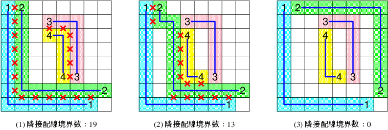

# 誰にも解けない問題を作ろう！
## DAシンポジウム2018 アルゴリズムデザインコンテスト 出題者編

このページでは、[DAシンポジウム2018](http://www.sig-sldm.org/das/)で行うアルゴリズムデザインコンテスト(ADC)に関して、新たに設けられた「問題コンテスト」について解説します。

## 最新情報

- 2017-06-11 初版を公開しました

## 概要

DAシンポジウムでは、2012年よりデザインコンテストを開催しております。コンテスト参加者の皆様には、あらかじめ出題される課題に対して解法を実現するプログラムを作成していただいています。

2018年のADCでは、解答者側だけではなく、出題者側の問題コンテストも開催します。いろいろな解法・アルゴリズムを駆使して解答を得ようとするコンテスト参加者に対して、解くのが難しいと思われる問題を作成してください。
DAシンポジウム2018にご参加いただき、コンテストで解くことができなかった問題を作成した方に対して優秀問題賞を授与いたします。

## 問題コンテスト参加方法

作成して頂いた問題とその解答を、最大5個まで、事前に実行委員会に提出して頂きます。（解答が一緒に提出されていない問題は当日扱いません。）

- 問題受付期間 : 2018年6月〜8月
- 提出先E-mail : das-adc-q [at] googlegroups.com  （[at]は＠に変換して下さい）
- 件名：DAS2018 ADC-Q:出題者名
- 本文：コンテスト終了後に出題したものを、GitHubで公開することを許可するかしないかの情報を本文中に記載してください。

        GitHubでの公開：許可／不許可

- ファイル添付：問題と解答をzip形式の圧縮ファイルとして添付して下さい。

問題コンテスト参加者は、DAシンポジウム2018への参加申し込みは任意としますが、ご参加頂けない方は表彰対象外といたします。よろしくお願いいたします。

### 権利関係の注意事項

- 論文投稿等と同じく、オリジナルの問題であることを出題者が明言したものとします。
- 著作権は出題者にあるとします。
- コンテスト終了後、GitHubで公開することを許可するかしないか、出題者に選択して頂きます。

#### 問題フォーマット

1. 盤面サイズは [X]X[Y]X[Z] の形で表される
      1. (X,Y): 盤面平面のマスの数を表す(X:横方向、Y:縦方向)
      2. Z    : 盤面の層の数を表す
2. 盤面平面のサイズは最大で72x72 (つまり、X,Y はそれぞれ 1 ≦ X ≦ 72, 1 ≦ Y ≦ 72を満たす)
3. 層数は最大で8 (つまり、Z は 1 ≦ Z ≦ 8 を満たす)
4. LINEの定義がある。LINE は 連続する自然数 (1,2,...) で表される
5. 各LINEは、LINEを表す数字と、端点を示す複数の位置 (x,y,z) により定義される
   (0 ≦ x ＜X, 0 ≦ y ＜Y, 1 ≦ z ≦ Z)
      1. LINEは分岐しない、つまり、端点を示す位置の数は2個とする
      2. LINEは層をまたいでも良いし、またがなくても良い。つまり、端点を示す2つの位置
         (x1,y1,z1), (x2,y2,z2) について、z1 ＝ z2 でも z1 ≠ z2 でも良い
6. LINE数に上限なし
7. 必ず事前に[nlcheck.py](nlcheck.html)を通ることを確認してから提出する（nlcheck.pyを通らなかったものは当日使用しない）

#### 問題フォーマットの例

[テキストダウンロード](docs/sample_Q_A.zip)

## 2018年度 ADC 競技内容：3次元IC接続、ビア位置指定なし

2018年のテーマは、昨年に引き続き、「ナンバーリンク」の解を、自動で求めるシステムのデザイン(設計)です。ナンバーリンクとは、マス目内に数字が配置され、同じ数字の間を、縦横の線で重ならないように結ぶパズルであり、電子回路の自動配線と非常に親和性が高い問題です。

2015年には、「解の品質」を導入し、複数の解がある場合に、もっとも品質のよい解を求めることを目指しました。

<!---    （解の品質） ＝ １／（（線長の合計）＋（線が曲がった回数）） --->

2016年には、3D配線問題を模した形式に拡張しました。その際、盤面間を接続するマス
(ビアと呼ぶ)の位置は予め指定されていました。

2017年には、ビアの位置を指定せず、自由に選べるようにしました(線の端点が直接ビアに接続されるのも可)。また、盤面サイズの最大値を36X36から72X72に拡大しました。

2017年のADCでは、残念ながら全問正解するチームはありませんでした。そこで、2018年は、基本的なルールおよび問題サイズは2017年を踏襲するものとします。ただし、解の品質に関して、以下の評価項目を付け加えます。

    Z平面において、縦方向（Y方向）、横方向（X方向）それぞれにおいて、3マス以上他の線と隣接しているマス数が少ないこと

上図(1)、上図(3)は線長の合計と線が曲った回数は同じですが、5マス以上隣接している境界の数が19と0で異なります。(3)の方が品質がよいものとします。
上図(2)のLINE1とLINE2のように、一旦離れて再度隣接した場合は合計でカウントします。

この制約は、LSIチップにおけるクロストーク問題の影響をできるだけ小さくするため、ある2つの配線が平行して通る長さを短くするように配線することを意識した指標です。また、この評価指標は、Z方向の各配線層内のみで適用するものとします。異なるZ平面で配線が隣接していてもカウントしません。

これに合わせて、2018年の解の品質の式は、以下のようになります。

    （解の品質） ＝ １／（（線長の合計）＋（線が曲がった回数）＋ ａ×（隣接配線境界数））
    2018年は係数ａ＝１／３

## ルールの詳細

- [ルールの詳細](rule.md)

## 参考情報

- [ソルバー作成に参考になる情報](ref.md)

---
※ 「ナンバーリンク」は株式会社ニコリの登録商標です。

Copyright (c) 2018 DAシンポジウム実行委員会
