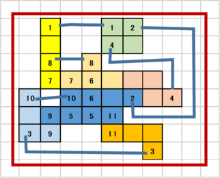

# DAシンポジウム2019 アルゴリズムデザインコンテスト

このサイトでは、[DAシンポジウム2019](http://www.sig-sldm.org/das/)で行うアルゴリズムデザインコンテスト(ADC)の参加者向け解説、およびコンテスト内にて使用する「自動運営システム」についての解説を行います。

## 最新情報

- 2019-05-27 [問題データで、ブロックの形状を定義するときの記号を変更しました。](rule.md#update)
- 2019-04-26 初版を公開しました

## 概要

DAシンポジウムでは、2012年よりデザインコンテストを開催しております。コンテスト参加者の皆様には、あらかじめ出題される課題に対して解法を工夫していただき、解法を実現するプログラム（システム）を作成していただきます。DAシンポジウム会期中に行われるADCセッションでは、参加チームの間でコンペティションを行っていただき、審査によって、下記の賞を授与いたします。

- 最優秀賞
  - 規定時間内で最高得点を獲得したチームに授与します。同点の場合は、最も早くその点数を獲得したチームに授与します。
  - 運営側参加チームは対象外とします。
- 特別賞
  - 方式のオリジナリティやコストパフォーマンス等の観点で独創性を持った手段を用いたチームに授与します。開催当日のポスターセッションの内容と競技の得点によって審査します。

## コンテスト参加方法

ADCへの参加を希望する方は、DAシンポジウム2019の発表申込フォームより申し込みください。
[論文募集ページ](http://www.sig-sldm.org/das/CFP.html)（申込み締切 2019年6月21日）

なお、コンテスト参加者は、DAシンポジウム2019への参加申し込みも必須となります。よろしくお願いいたします。

## 2019年度 ADC競技内容：配置配線パズル

2019年は競技内容をリニューアルします。
これまでは「ナンバーリンク」を題材としてきましたが、
今回はナンバーリンクに配置問題の要素を加えた新たな「配置配線パズル」を対象とします。
配置配線パズルの解を自動で求めるシステムを設計し、その性能を各チームで競ってもらいます。

ナンバーリンクとは、マス目内に数字が配置され、同じ数字の間を縦横の線で重ならないように結ぶパズルであり、電子回路の自動配線と非常に親和性が高い問題です。
ナンバーリンクでは数字マスの位置は固定されていましたが、今回の「配置配線パズル」では数字は盤面上を移動可能なブロック上に配置されます。
数字間の配線とブロックの位置を同時に考慮しつつ、できるだけ省面積な配置配線を行うことが目標となります。

問題例を以下に示します。

　→　

左側が使用するブロックです。
各ブロックの一部のマス目には数字が入っています。
各数字は2回ずつ現れ、必ずペアになっています。
これらのブロックを盤面上で移動させつつ、ナンバーリンクのように数字間もつないでいきます。
数字間を結ぶ線も盤面上のマス目を使用します。

右側がこの例題の解答例です。
全てのブロックが配置され、全ての数字ペアが接続されたものが解となります。
（数字間の配線は、ブロック同士を直接隣接させても構いません。）

求めた解の良さは、全てのブロックと配線マスを囲む最小の矩形面積で評価します。
競技時間内に多くの問題を良いスコアで解いたチームが高得点を獲得できます。

## ルールの詳細

- [ルールの詳細](rule.md)

<!--
## 自動運営システム

- [自動運営システム](conmgr.md)
-->

<!--
## 開催結果

- [結果PDF](ADC2019_result.pdf)
- [問題](Questions_2019.zip)
- [解答例](Answers_2019.zip)
-->

---
※ 「ナンバーリンク」は株式会社ニコリの登録商標です。

Copyright (c) 2019 DAシンポジウム実行委員会
