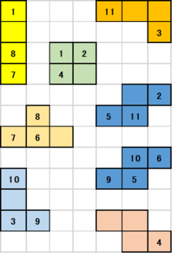

# アルゴリズムデザインコンテスト2019（ADC2019）ルール説明

<a name="update"></a>
### 更新情報

- (2019-05-27) 紛らわしさを回避するため、問題データで、ブロックの形状を定義するときの記号を変更しました。`0`-->`+`、`*`-->`0`


### 概要

- 2019年のテーマは、ADC2018までのナンバーリンクに配置問題の要素を加えた「配置配線パズル」とする
- 数字が書かれた複数のブロックが用意されており、これらを1つの盤面上に配置し、同じ数字の間を線で接続する
- ブロックは盤面上を横方向(X)、縦方向(Y)に移動できる
- ブロックは回転・反転させてはいけない
- 配線は横方向(X)、縦方向(Y)に引くことができる（ナンバーリンクと同じ）
- 配線は1マスに1本のみ引くことができ、交差・分岐してはいけない（ナンバーリンクと同じ）
- 解の品質は「全てのブロックと配線マスを囲む最小の矩形面積」で評価する

※ 「ナンバーリンク」は株式会社ニコリの登録商標です。

#### 問題例


#### 解答例
  
この場合の解の品質は「横9マス×縦8マス＝72」となる

### 詳細

#### 問題フォーマット

1. 盤面サイズは `SIZE [X]X[Y]` の形で定義される
      - (X,Y): 盤面平面のマスの数を表す（X:横方向、Y:縦方向）
2. 盤面平面のサイズは最大で72x72（つまり、X,Yはそれぞれ 1≦X≦72, 1≦Y≦72 を満たす）
3. 使用ブロックの数は `BLOCK_NUM [N]` で定義される。Nはブロックの数であり、連続する自然数 (1,2,...) で表される
4. 各ブロックは、ブロックの通し番号を示す数字と、ブロック形状および配線の端点を示す数字・記号列により定義される
      1. ブロックの形状は1マスのモノミノ、および5種類の[テトロミノ](https://ja.wikipedia.org/wiki/%E3%83%86%E3%83%88%E3%83%AD%E3%83%9F%E3%83%8E)のうちいずれかである
      2. ブロックのサイズは `BLOCK#[i] [W]X[H]` で定義される。iはブロック番号、WとHはそれぞれブロックの幅と高さである
      3. ブロック内の数字の配置はカンマ区切りで記述される。配線の端点となるマスには数字が入る。数字が入らないブロック内のマスは `+` で示される。ブロック外の領域は `0` で示される。すべてが`+`のブロックもあり得る
      4. 配線の端点は必ずペアを成す。つまり、全てのブロック中で使用される数字は必ず2回ずつ現れる
5. ブロック数に上限はない（コンテストとしては、[nlcheck.py](nlcheck.html)を通ることは事前確認されたい）

#### 回答フォーマット

1. 全てのブロックを囲む矩形サイズ、盤面上の数字の2次元フォーマット、および各ブロックの配置座標を記述したものがADC2019の回答フォーマットとなる
2. 全てのブロックを囲む矩形サイズは `SIZE [W]X[H]` の形式で記述する
3. 盤面上の数字の2次元回答フォーマットは、各マスに数字を当てはめたものとする（2018年度までと同様）
4. ブロックの配置座標は `BLOCK#[i] @([X],[Y])` の形式で記述する。iはブロック番号、(X,Y)はブロックの左上端マス(ブロック外 `0` の場合も含む)の座標である。座標系は盤面の左上端を原点(0,0)とする

#### 問題フォーマット、回答フォーマットの例
上の問題例・解答例に対応する問題・回答フォーマット例を以下に示す

[テキストダウンロード](docs/sample_Q_A.zip)

##### 問題フォーマット例
```
SIZE 10X10
BLOCK_NUM 8

BLOCK#1 1X4
1
+
8
7

BLOCK#2 3X2
0,8,0
7,6,+

BLOCK#3 2X3
10,0
 +,0
 3,9

BLOCK#4 2X2
1,2
4,+

BLOCK#5 3X2
11,+,+
 0,0,3

BLOCK#6 3X2
0, +,2
5,11,0

BLOCK#7 3X2
0,10,6
9, 5,0

BLOCK#8 3X2
+,+,0
0,+,4
```

##### 回答フォーマット例
```
SIZE 9X8
 0, 1, 1, 1, 1, 2, 2, 2, 2
 0, 0, 0, 0, 4, 0, 0, 0, 2
 0, 8, 8, 8, 4, 4, 4, 4, 2
 0, 7, 7, 6, 0, 0, 0, 4, 2
10,10,10, 6, 0, 2, 0, 4, 2
 0, 9, 5, 5,11, 2, 2, 2, 2
 3, 9, 0, 0,11, 0, 0, 0, 0
 3, 3, 3, 3, 3, 3, 3, 0, 0
BLOCK#1 @(1,0)
BLOCK#2 @(2,2)
BLOCK#3 @(0,4)
BLOCK#4 @(4,0)
BLOCK#5 @(4,6)
BLOCK#6 @(3,4)
BLOCK#7 @(1,4)
BLOCK#8 @(5,3)
```

#### 回答ルール

1. 問題で指定された全てのブロックを盤面上に配置する
    1. ブロックは回転、反転させてはならない。上下左右の平行移動のみ行う
    2. ブロック同士は重なって配置してはならない
2. ブロック上の端点の間を交差・分岐の無い配線で接続する
    1. 配線の端点が存在するマスは、X, Y方向に隣接する最大4個のマスのうち1個と接続される（ナンバーリンクと同じ）
    2. 配線を構成する端点以外のマスは、X, Y方向に隣接する最大4個のマスのうち2個と接続される（ナンバーリンクと同じ）
2. 問題で指定された端点に接続しない線を引いてはならない（ナンバーリンクと同じ）
3. ブロックまたは配線に属さないマスには`0`を当てはめる
4. ブロック外の領域(`0`で示されるマス)には、線を引ける。数字が入らないブロック内のマス（`+`で示されるマス)には、線を引けない。

**(注)** チェックツールの仕様により、同じ数字の置かれたマスは接続されているものとみなす。コの字型の迂回がある回答などは、上記のルールに違反する場合があるため注意すること（2018年度までと同様。詳細は[こちら](https://github.com/dasadc/conmgr/issues/18)を参照）


#### その他
※以下は暫定版です。今後変更の可能性があります。
- 問題ファイル、回答ファイルは1問1ファイルのテキスト形式。文字コードはASCII、改行コードはCR+LF(Windowsなど)、または、LF(UNIX, Linux, MacOS Xなど)
- 参加1チームあたり最大3問まで問題を自作して当日提供可能
- 問題ファイル、回答ファイルは、運営側が準備する会場の無線LANアクセスポイント(802.11b/g)経由で自動運営システムとの間でやり取りする
- 一度回答を提出した問題を、再度回答するのは不可
- 会場以外の場所(遠隔地)にソルバーを設置して、ネットワーク経由で利用するのは不可
- 事前に作成した自作問題の解をそのまま提出するのは不可。自作の問題も競技時間内にソルバーで解くこと
- 求解手法を当日ポスターで発表すること

### 得点の計算方法

#### 計算式
※以下は暫定版です。今後変更の可能性があります。
- 正解ポイント：問題ごとに、正解のとき+1ポイント
- 品質ポイント：問題ごとに、正解した全チームへ10ポイントを解の品質に応じて比例配分  
  `(解の品質) = 1 / (全ブロックと配線を囲む矩形面積)`… 値が大きいほど良い解  
- 出題ボーナスポイント：参加チームが持参した問題を自分で正解したとき、ボーナスで+1ポイント

### 質問・不具合等
GitHubの[Issues](https://github.com/dasadc/dasadc.github.io/issues)にご登録下さい


---
Copyright (c) 2019 DAシンポジウム実行委員会
