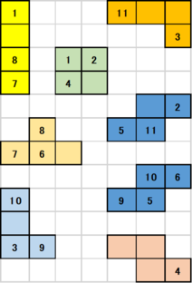

# DAシンポジウム2020 アルゴリズムデザインコンテスト

このサイトでは、[DAシンポジウム2020](http://www.sig-sldm.org/das/)で行うアルゴリズムデザインコンテスト(ADC)の参加者向け解説、およびコンテスト内にて使用する「自動運営システム」についての解説を行います。

## 新型コロナウイルス（COVID-19）への対応について (2020/06/19 更新)

**アルゴリズムデザインコンテストをオンライン開催**といたします。

DAシンポジウム2020は、新型コロナウイルス感染症の状況を鑑み、開催形態をオンライン開催と決定いたしました ([DAS2020オンライン開催決定に関してSLDM研究会主査からのメッセージ](http://www.sig-sldm.org/das/message.html))。
これに併せてADCもオンライン開催とし、競技は**リモートマシンによる競技**、従来実施していたポスター発表は**リモート会議システム上でのライトニングトーク発表に変更**いたします。

なお、オンライン開催に伴い、リモートマシンの使用を前提としたルールに変更いたします (昨年度までは、使用マシンに関するルールとして、現地持ち込みできるものに限定しておりました)。
参加者間の計算機パワーの差が従来よりも大きくなると予想されるため、評価方式も併せてアップデートすることを検討しております。詳細は別途、ルールページにて発表いたしますが、**使用計算機のスペック(計算能力)を公開いただく可能性が高い**です。ご参加の際にはご承知おきください。

## 最新情報

- 2020-08-06 概要欄にて、**グリーン賞**について追記しました。
- 2020-07-22 [ADC2019ページ](https://dasadc.github.io/adc2019/#開催結果)にて、ADC2019で使用された問題および解答例を掲載しました。ご活用ください。
- 2020-06-19 **オンライン開催**に決定しました。
- 2020-06-19 **参加申し込み締切を 6/26 (金) まで延長**しました。
- 2020-06-19 [GitHub](https://github.com/dasadc/adc2019/tree/adc2020)をアップデートしました。
    - **以降、adc2020 ブランチを参照ください**。
    - **回答フォーマットが若干変更されております**。ご注意ください
- 2020-04-18 サンプルコードへのリンクを[公開](#参考:サンプルコードへのリンク)しました。
- 2020-04-01 初版を公開しました

## 概要 (2020/08/06 更新)

DAシンポジウムでは、2012年よりデザインコンテストを開催しております。コンテスト参加者の皆様には、あらかじめ出題される課題に対して解法を工夫していただき、解法を実現するプログラム（システム）を作成していただきます。DAシンポジウム会期中に行われるADCセッションでは、参加チームの間でコンペティションを行っていただき、審査によって、下記の賞を授与いたします。
（現在詳細検討中。変更の可能性があります）

- 最優秀賞
  - 規定時間内で最高得点を獲得したチームに授与します。同点の場合は、最も早くその点数を獲得したチームに授与します。
  - 運営側参加チームは対象外とします。
- 特別賞
  - 方式のオリジナリティやコストパフォーマンス等の観点で独創性を持った手段を用いたチームに授与します。開催当日のライトニングトークセッションの内容と競技の得点によって審査します。
- グリーン賞(ADC2020新規)
  - 規定時間内での得点と、その計算時に使用した電力量から求められる得点電力効率が最も高いチームに授与します。
  - 電力量は、運営から各参加チームに貸与される電力計を用いて計測され、当日競技時の値を報告するものとします。
  - 電力計が使用不可能な場合、本賞選考の対象外となります。

## コンテスト参加方法 (2020/06/19 更新)

ADCへの参加を希望する方は、DAシンポジウム2020の発表申込フォームより申し込みください。

[論文募集ページ](http://www.sig-sldm.org/das/CFP.html)（申込み締切 2020 年 **6月26日(金)** まで延長しました）

なお、コンテスト参加者は、DAシンポジウム2020への参加申し込みも必須となります。よろしくお願いいたします。

## 2020年度 ADC競技内容：配置配線パズル

2020年は、2019年と同様の「配置配線パズル」を競技内容とします。
「配置配線パズル」はナンバーリンクに配置問題の要素を加えたパズルです。
配置配線パズルの解を自動で求めるシステムを設計し、その性能を各チームで競ってもらいます。

ナンバーリンクとは、マス目内に数字が配置され、同じ数字の間を縦横の線で重ならないように結ぶパズルであり、電子回路の自動配線と非常に親和性が高い問題です。
ナンバーリンクでは数字マスの位置は固定されていましたが、「配置配線パズル」では数字は盤面上を移動可能なブロック上に配置されます。
数字間の配線とブロックの位置を同時に考慮しつつ、できるだけ省面積な配置配線を行うことが目標となります。

問題例を以下に示します。

　→　

左側が使用するブロックです。
各ブロックの一部のマス目には数字が入っています。
各数字は2回ずつ現れ、必ずペアになっています。
これらのブロックを盤面上で移動させつつ、ナンバーリンクのように数字間もつないでいきます。
数字間を結ぶ線も盤面上のマス目を使用します。

右側がこの例題の解答例です。
全てのブロックが配置され、全ての数字ペアが接続されたものが解となります。
（数字間の配線は、ブロック同士を直接隣接させても構いません。）

求めた解の良さは、全てのブロックと配線マスを囲む最小の矩形面積で評価します。
競技時間内に多くの問題を良いスコアで解いたチームが高得点を獲得できます。

## ADC2019 からの変更点（検討中含む）

- 各参加チームの使用計算システム構成を公開いただくことを検討中。コストパフォーマンス評価やオンライン競技化のため。

## ルールの詳細

- [ルールの詳細](rule.md)

## 参考:サンプルコードへのリンク

新規に参加をご検討される方々への参考として、前回ADC2019参加チームの方々から、プログラム・ソースコード（の一部）を公開・ご提供いただきました。
アルゴリズムデザインコンテストの感触をつかむための一助としていただければ幸いです。

なおADC2019で使用されたコードであるため、[ADC2020ルール](rule.md)とは若干整合しないところが含まれる可能性があります。ご注意ください。

* 早稲田大学 戸川研究室チーム「Togawa the 6th」よりご提供
  * [公開GitLabページ](https://www.togawa.cs.waseda.ac.jp/gitlab/adc2019/adc2019-system)

* 九州大学 「九州大チーム」よりご提供
  * [公開GitHubページ](https://github.com/yusuke-matsunaga/adc2019lite.git)

プログラム公開にご賛同・ご協力いただいた上記チームの方々に深くお礼申し上げます。

<!--
## 自動運営システム

- [自動運営システム](conmgr.md)
-->

<!--
## 開催結果

- [結果PDF](ADC2020_result.pdf)
- [問題](Questions_2020.zip)
- [解答例](Answers_2020.zip)
-->

---
※ 「ナンバーリンク」は株式会社ニコリの登録商標です。

Copyright (c) 2020 DAシンポジウム実行委員会
