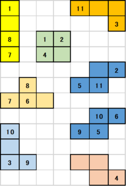
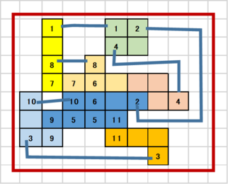

# DAシンポジウム2021 アルゴリズムデザインコンテスト

このサイトでは、[DAシンポジウム2021](http://www.sig-sldm.org/das/)で行うアルゴリズムデザインコンテスト(ADC)の参加者向け解説、およびコンテスト内にて使用する「自動運営システム」についての解説を行います。

## 新型コロナウイルス（COVID-19）への対応について

DAシンポジウム2021の開催形態(現地・オンライン)については現在検討中ですが、
ADCは2020年と同様のリモートマシンの使用を前提としたルールとします (2019年度までは、使用マシンに関するルールとして、現地持ち込みできるものに限定しておりました)。
参加者間の計算機パワーの差が従来よりも大きくなると予想されるため、**使用計算機のスペック(計算能力)を公開いただく予定**です。ご参加の際にはご承知おきください。

## 最新情報

- 2021-03-30 初版を公開しました

## 概要 

DAシンポジウムでは、2012年よりデザインコンテストを開催しております。コンテスト参加者の皆様には、あらかじめ出題される課題に対して解法を工夫していただき、解法を実現するプログラム（システム）を作成していただきます。DAシンポジウム会期中に行われるADCセッションでは、参加チームの間でコンペティションを行っていただき、審査によって、下記の賞を授与いたします。
（現在詳細検討中。ルールは変更の可能性があります）

- 最優秀賞
  - 規定時間内で最高得点を獲得したチームに授与します。今年度は、事前に問題を公開する長時間用の問題と、競技開始時に問題を公開する短時間用の問題を設ける予定です。
  - 運営側参加チームは対象外とします。
- 特別賞
  - 方式のオリジナリティやコストパフォーマンス等の観点で独創性を持った手段を用いたチームに授与します。開催当日のライトニングトークセッションの内容と競技の得点によって審査します。
- グリーン賞
  - 規定時間内での得点と、その計算時に使用した電力量から求められる得点電力効率が最も高いチームに授与します。
  - 電力量は、運営から各参加チームに貸与される電力計を用いて計測され、当日競技時の値を報告するものとします。
  - 電力計が使用不可能な場合、本賞選考の対象外となります。

## コンテスト参加方法

ADCへの参加を希望する方は、DAシンポジウム2021の発表申込フォームより申し込みください。

[論文募集ページ](http://www.sig-sldm.org/das/CFP.html)

なお、コンテスト参加者は、DAシンポジウム2021への参加申し込みも必須となります。よろしくお願いいたします。

## 2021年度 ADC競技内容：配置配線パズル

2021年は、2020年と同様の「配置配線パズル」を競技内容とします。
「配置配線パズル」はナンバーリンクに配置問題の要素を加えたパズルです。
配置配線パズルの解を自動で求めるシステムを設計し、その性能を各チームで競ってもらいます。

ナンバーリンクとは、マス目内に数字が配置され、同じ数字の間を縦横の線で重ならないように結ぶパズルであり、電子回路の自動配線と非常に親和性が高い問題です。
ナンバーリンクでは数字マスの位置は固定されていましたが、「配置配線パズル」では数字は盤面上を移動可能なブロック上に配置されます。
数字間の配線とブロックの位置を同時に考慮しつつ、できるだけ省面積な配置配線を行うことが目標となります。

問題例を以下に示します。

　→　

左側が使用するブロックです。
各ブロックの一部のマス目には数字が入っています。
各数字は2回ずつ現れ、必ずペアになっています。
これらのブロックを盤面上で移動させつつ、ナンバーリンクのように数字間もつないでいきます。
数字間を結ぶ線も盤面上のマス目を使用します。

右側がこの例題の解答例です。
全てのブロックが配置され、全ての数字ペアが接続されたものが解となります。
（数字間の配線は、ブロック同士を直接隣接させても構いません。）

求めた解の良さは、全てのブロックと配線マスを囲む最小の矩形面積で評価します。
競技時間内に多くの問題を良いスコアで解いたチームが高得点を獲得できます。

## ADC2020 からの変更点（検討中含む）

- 規模の大きい問題を事前に公開し、長時間かけて回答を競う問題を検討中です。

- 早く問題を回答するほど高得点となるルールを導入予定です。

## ルールの詳細

- 近日公開予定

## 参考:サンプルコードへのリンク

- 近日公開予定

---
※ 「ナンバーリンク」は株式会社ニコリの登録商標です。

Copyright (c) 2021 DAシンポジウム実行委員会
