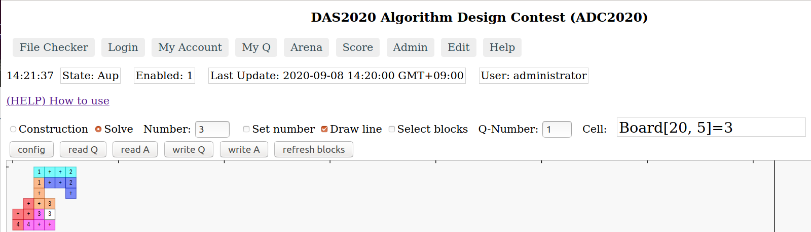

13:00〜「8A: アルゴリズムデザインコンテスト」のお知らせ
=====================================================

当日参加できます。

> コンテストって何をするの？

[「2021年度 ADC競技内容：配置配線パズル」](index.md#puzzle)をご覧ください。

アルゴリズムデザインコンテスト当日参加について
--------------------------------------------

ADC専用ウェブアプリを使って、問題に挑戦できます。
ウェブアプリは、[こちらです](https://dasadc.github.io/static/app/index.html#/edit)

screen shot 1  

screen shot 2  

使い方は、[このドキュメント](https://github.com/dasadc/adc2019/blob/adc2020-yt/client-app/README.md#edit) を見てください。

コンテスト開始後、問題データファイルを入手するためのURLを、webexのチャットで送ります。

1. ウェブアプリで、問題データファイルをアップロードして、
2. 問題をといて、
3. 回答データをファイルに保存してください。
4. コンテスト時間終了後(14:50予定)に、ファイルをzipでアーカイブして、メールで送付してください。送付先アドレスは、その時にお知らせします

ウェブアプリの使い方
------------------------

### (1) 問題データの入手

[問題データ(開催初日にアップ予定)](https://github.com/dasadc/adc2019/tree/adc2020-yt/samples/Q)

ファイルをクリックして表示してから、「Raw」を右クリックして、ファイルに保存してください。

例  
- [sample_hiromoto_10_Q.txt](https://github.com/dasadc/adc2019/raw/adc2020-yt/samples/Q/sample_hiromoto_10_Q.txt)
- [sample_hiromoto_10_Q.txt](https://raw.githubusercontent.com/dasadc/adc2019/adc2020-yt/samples/Q/sample_hiromoto_10_Q.txt)

### (2) 問題データをアップロードする

[ウェブアプリ](http://das-adc.duckdns.org:22113/static/app/index.html#/edit)
にアクセスします。

- ラジオボタン「Solve」をクリックして選択する。
- 「read Q」ボタンをクリックする。
- ファイル選択のボタンで問題データファイルを選択するか、ドラッグアンドドロップして、ファイルを指定する。
- 「OK, use this file」ボタンをクリックする。

これで、問題データのブロックが、画面右端のところに表示されます。

### (3) 問題を解く

1. ブロックをドラッグして、画面左側の四角形の領域内（＝盤面）に配置していきます。
2. 同じ数字同士を結ぶように、線を引きます。「Number」テキストボックスに数字を入力し、「Draw line」チェックボックスをonにして、盤面をクリックしてください。そこに「番号が入った線のセル」が作られます。

- ブロック、線のセル、ともに、ドラッグして、移動できます。
- オブジェクトを複数選択して、まとめてドラッグして移動できます。
- Shift + clickで、追加選択できます。
- または、Select blocksチェックボックスをonにしてから、矩形領域をドラッグしてまとめて選択できます。

### (4) 回答データをファイルに保存する

「write A」ボタンをクリックして、ファイル名を指定して、ダウンロードしてください。

言い忘れました。「Q-Number」に、問題データの番号を入力しておけば、それがファイル名に使われます。
