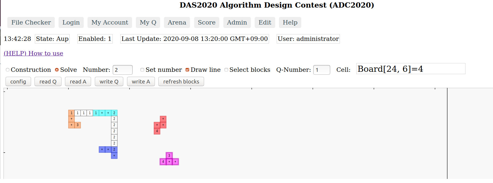
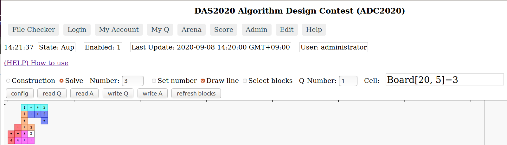

13:00〜「8A: アルゴリズムデザインコンテスト」のお知らせ
=====================================================

当日参加できますので奮ってご参加ください！

> コンテストって何をするの？

[「2022年度 ADC競技内容：配置配線パズル」](index.md#puzzle)をご覧ください。

アルゴリズムデザインコンテスト(ADC)当日参加企画について
--------------------------------------------

ADC専用ウェブアプリを使って、問題に挑戦できます。
ウェブアプリは[こちらです](https://dasadc.github.io/static/app/index.html#/edit)。

Chrome、FireFoxをご利用ください。

screen shot 1  

screen shot 2  

詳しい使い方は[こちらのドキュメント](https://github.com/dasadc/adc2019/blob/adc2020-yt/client-app/README.md#edit) をご覧ください。

1. ウェブアプリで、問題データファイルを読み込んで、
2. 問題を解いて、
3. 解答データをファイルに保存してください。
4. コンテスト当日のADCセッション終了までに、解答ファイルをメールで送付してください。送付先アドレスは<das-adc2022today@googlegroups.com>です。

ウェブアプリの使い方
------------------------

### (1) 問題データの入手

- 当日参加企画の問題：[当日参加問題](docs/onsite_today.zip)

- [サンプル問題データ](https://github.com/dasadc/adc2019/tree/adc2020-yt/samples/Q)はファイルをクリックして表示してから、「Raw」を右クリックしてファイルに保存してください。
    - 例
        - [sample_hiromoto_10_Q.txt](https://github.com/dasadc/adc2019/raw/adc2020-yt/samples/Q/sample_hiromoto_10_Q.txt)
        - [sample_hiromoto_10_Q.txt](https://raw.githubusercontent.com/dasadc/adc2019/adc2020-yt/samples/Q/sample_hiromoto_10_Q.txt)

### (2) 問題データを読み込む

[ウェブアプリ](https://dasadc.github.io/static/app/index.html#/edit)
にアクセスします。
ブラウザはChrome、Firefoxをご利用ください。

- ラジオボタン「Solve」をクリックして選択する。
- 「read Q」ボタンをクリックする。
- ファイル選択のボタンで問題データファイルを選択するか、ドラッグアンドドロップでファイルを指定する。
- 「OK, use this file」ボタンをクリックする。

これで問題データのブロックが画面右端のところに表示されます。

### (3) 問題を解く

1. ブロックをドラッグアンドドロップで画面左側の四角形の領域内（＝盤面）に配置していきます。
2. 同じ数字同士を結ぶように線を引きます。「Number」テキストボックスに数字を入力し、「Draw line」チェックボックスをonにして盤面をクリックしてください。そこに「番号が入った線のセル」が作られます。「Set Number」をチェックすると番号を上書きすることもできます。

- ブロックと線のセルは、ともにドラッグで移動可能です。
- オブジェクトを複数選択して、まとめてドラッグして移動できます。
    - Shift + clickで複数選択できます。
    - あるいはSelect blocksチェックボックスをonにした上で矩形領域でまとめて選択できます。
- deleteボタンで線を削除できます。
- 番号をうまく上書きできない場合には、文字から少しずらした位置をクリックしてください。

### (4) 解答データをファイルに保存する

- 「write A」ボタンをクリックして、ファイル名を指定してダウンロードしてください。
- なお「Q-Number」に問題データの番号を入力しておけば、その番号がファイル名に使用されます。

### (5) 解答データをチェックする

- 作成した解答ファイルを、問題ファイルと一緒に[こちらのウェブアプリ](https://das-adc.appspot.com/static/app/index.html#/file-checker)に入力することで解答が有効であるかチェックできます。
- 「Q-file」欄に問題ファイルを、「A-file」欄に解答ファイルを入力した上で「Check files」ボタンをクリックしてください。
- 有効な解答ファイルである場合には「Check results」欄の先頭に「check_file ok」と表示され、「board」欄に解答ファイルが図示されます。
- 解答ファイルが無効の場合には「Check results」欄に表示されるメッセージを参考に解答を修正して下さい。

---
Copyright (c) 2022 DAシンポジウム実行委員会

