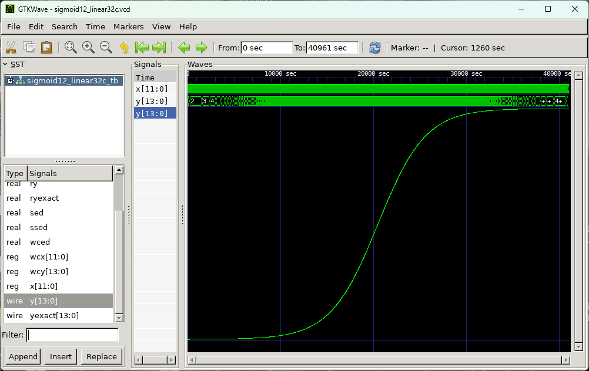

# DAシンポジウム2023 アーキテクチャデザインコンテスト

このサイトでは、[DAシンポジウム2023](http://www.sig-sldm.org/das/)で行うアーキテクチャデザインコンテスト(ADC)の参加者向け解説を行います。

## 最新情報

- 2023-07-20 初版を公開しました

## 概要 

DAシンポジウムでは、2012年よりデザインコンテストを開催しております。コンテスト参加者の皆様には、あらかじめ出題される課題に対して解法を工夫していただき、解法を実現するプログラム（システム）を作成していただきます。DAシンポジウム会期中に行われるADCセッションでは、参加チームの間でコンペティションを行っていただき、審査によって賞を授与いたします。

DAシンポジウム2023参加者は当日参加が可能です。奮ってご参加ください。

## コンテスト参加方法
作品の提出締切は **2023年8月23日(水)** です。作品の提出を以ってコンテストへの参加申し込みと致します。[プログラム](http://www.sig-sldm.org/das/program.html#7A) に情報を載せるため、タイトル・氏名・所属を明記した上で das"at"sig-sldm.org へ作品提出をお願いします（"at"は@に変換してください）。
なお、コンテスト参加者は、DAシンポジウム2023への参加申し込みも必須となります。現地参加もしくはオンライン参加頂き、ライトニングトーク等をして頂くことを計画しています（詳細は応募件数が確定してからご連絡します）。よろしくお願いいたします。


## 課題
- Sigmoid関数 $y=1/(1+e^(-x))$ を計算する組み合わせ回路の演算器をVerilog-HDLで記述すること。結果の例を下図に示す。
- 入出力のビット数は以下の通りとする。
  - 入力x：符号1bit、整数部3bit、小数部8bit、計12bit
  - 出力y：符号1bit、整数部1bit、小数部12bit、計14bit
- 評価には、回路面積とRMS誤差を使用します。
  - 回路面積は、yosysで4-LUT向けに論理合成した時のLUT数とする（合成結果に2-LUTや3-LUTが含まれていても、4-LUTと同じように1個とカウントする）。面積による優劣を明確にするため、順序回路としての実現は不可とする。
  - RMS誤差は、真値に最も近い解の表現と作品で得られた解の表現の差分に 2<sup>12</sup> を乗じた値（つまり出力yのLSBの重みを1にスケーリングした絶対誤差）の2乗を入力xの値域全体に渡って平均したものの平方根とする。

<!--  -->


## 表彰
- 厳密計算部門最優秀賞
  - RMS誤差が0.0である作品の中で、回路面積最小のもの。
- 近似計算部門最優秀賞
  - RMS誤差が5.0未満である作品の中で、回路面積最小のもの。
- 特別賞
  - RMS誤差と回路面積のトレードオフの観点で独創性の高い試みを行ったもの。

## 参考作品と評価方法
- [参考作品と評価に用いるファイルをまとめたzipファイル](files/ref_eval.zip)

- 参考作品
  - [sigmo_exact.v](files/sigmo_exact.v) は、真値に最も近い解の表現を与えるよう、テーブル参照（case文）を使って実装した自明な作品である。他の作品の誤差評価の参照モデルとして使用する。
  - [sigmo_lin32.v](files/sigmo_lin32.v) は、等間隔（32点間隔）の線形補間により近似値を求める粗削りな作品である。
  - [sigmo_lin32c.v](files/sigmo_lin32c.v) は、上記の作品で生じる誤差を補償するためテーブル参照を併用した作品である。
- 誤差評価方法
  - [sigmo_lin32_tb.v](files/sigmo_lin32_tb.v) は、sigmo_lin32.v と sigmo_exact.v の出力の差分からRMS誤差を計算するテストベンチである。
  - iverilog がインストールされた Linux 環境の場合、コマンドラインで以下を実行するとRMS誤差(RMSE)が表示される。
    ```
    iverilog -g2012 -o sigmo_lin32.out sigmo_lin32_tb.v sigmo_lin32.v sigmo_exact.v
    vvp sigmo_lin32.out
    ```
- 回路面積
  - [sigmo_lin32.ys](files/sigmo_lin32.ys) は、sigmo_lin32.v を4-LUT向けに論理合成するためのyosysのスクリプトである。
  - yosysがインストールされたLinux 環境の場合、コマンドラインで以下を実行するとLUT数が表示される（2行目のコマンドは、sigmo_lin32_net.v ファイル中で、「\$lut」という文字列で始まる行数を求めている）。
    ```
    yosys < sigmo_lin32.ys
    grep -e '^ *\\\$lut ' sigmo_lin32_net.v | wc -l
    ```
- 実行結果
  - 他の作品も同様に評価して結果をまとめると表1のようになる。
  - sigmo_lin32.v は、RMS誤差が0.0を達成していないため、このままでは厳密計算部門の評価対象とはならないが、RMS誤差が5.0を下回るため、近似計算部門の評価対象となり得る。
  - sigmo_lin32c.v は、RMS誤差 0.0 を達成しており、面積も sigmo_exact より小さいので、厳密計算部門の評価対象となり得る。


<table>
  <caption>表1. 3つの参考作品の評価実行結果</caption>
  <thead>
    <tr>
      <th>作品ファイル名</th>
      <th>RMS誤差</th>
      <th>回路面積</th>
    </tr>
  </thead>
  <tbody>
    <tr>
      <td>sigmo_exact.v</td>
      <td>0.000000</td>
      <td>1485</td>
    </tr>
    <tr>
      <td>sigmo_lin32.v</td>
      <td>1.275042</td>
      <td>261</td>
    </tr>
    <tr>
      <td>sigmo_lin32c.v</td>
      <td>0.000000</td>
      <td>839</td>
    </tr>
  </tbody>
</table>

<!--
表1. 3つの参考作品の評価実行結果

| 作品ファイル名  | RMS誤差  |  回路面積     |
| --------------- | -------- | ------------- |
| sigmo_exact.v   | 0.000000 |  1485         |
| sigmo_lin32.v   | 1.275042 |  261          |
| sigmo_lin32c.v  | 0.000000 |  839          |
-->


## ご質問と回答
- シグモイド関数の値域に負の数や1.0以上の数が含まれないのに、何故 y は符号ビットや整数部があるのですか？
  - 近似計算を許容する場合、負の値や1.0以上の値が出力されてしまうことも想定されるので、このような仕様としました。
- 近似計算部門のRMS誤差5.0というのは、どのような想定ですか？
  - sigmoid_exact の下位4bitを4’b1000に固定すると、RMS誤差が4.615039になりますので、実質的に出力のbit数を4桁減らしたことほぼ等価です。なお、近似計算部門と厳密計算部門は要求精度は異なりますが入出力仕様は同じですので、テストベンチは同じものをお使いいただけます。
- iverilog や yosys の入手方法を教えて欲しい。
  - Linux 環境ですと比較的容易にインストールできます。例えば Ubuntu 環境であれば、次のコマンドでインストールできます。
  ```
  sudo apt install iverilog gtkwave yosys
  ```
- その他、質問がありましたら、das"at"sig-sldm.org までご連絡ください（"at"は@に変換してください）。


---

Copyright (c) 2023 DAシンポジウム実行委員会
