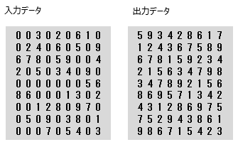
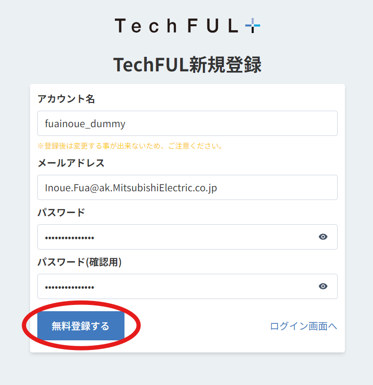
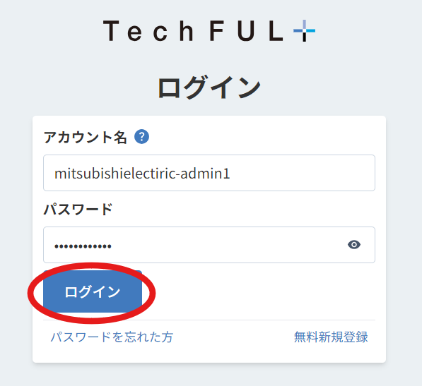
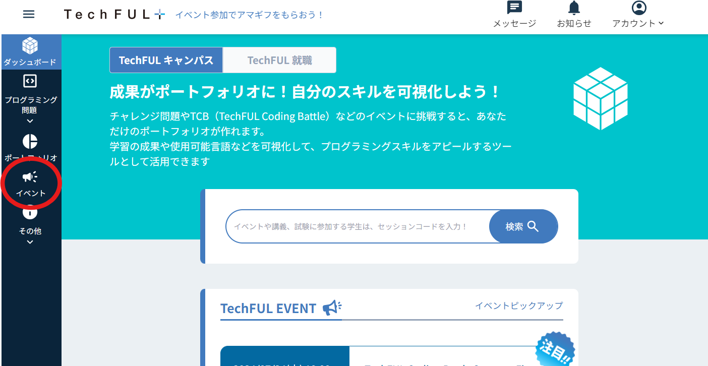
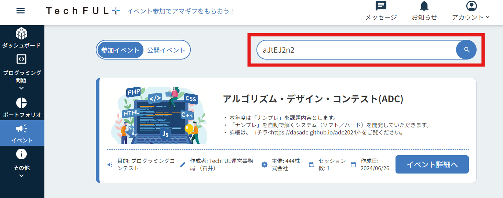
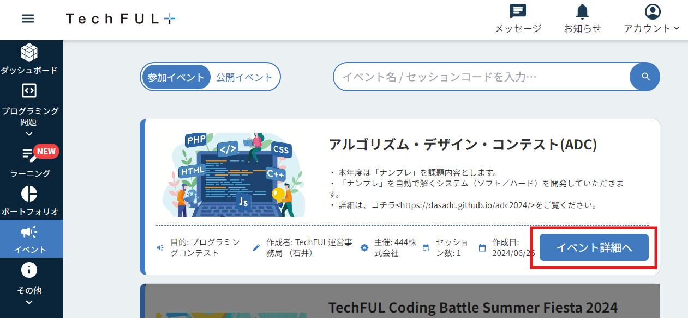
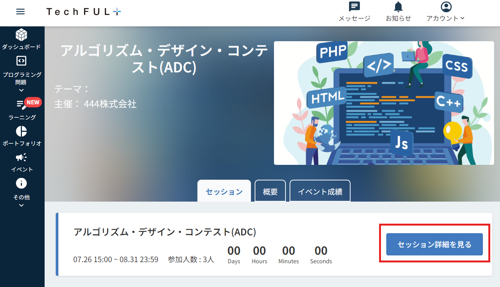
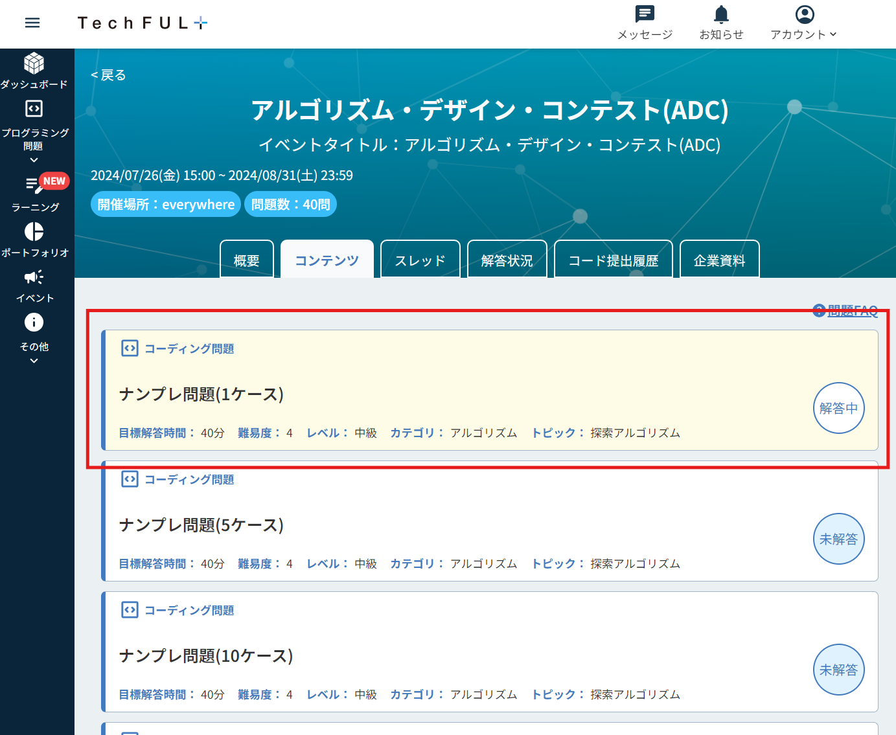
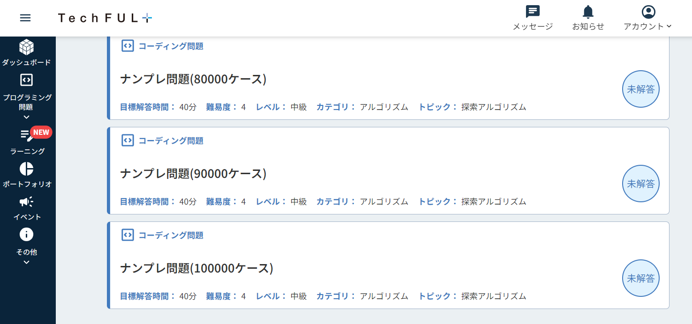
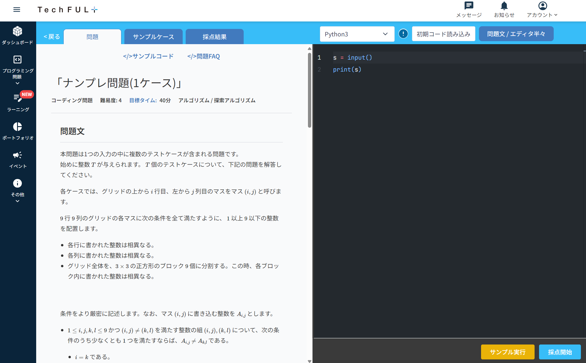

# プログラミング競技について

本年度は「ナンプレ」を競技内容とします。ナンプレの解を自動で求めるプログラムを作成していただき、その実行速度を競っていただきます。

## 問題説明

- 標準入力から 9x9 の「ナンプレ」データを入力し、標準出力に同じ 9x9 フォーマットの解答データを出力します。
- 入力データはスペース区切りで9個の数字を並べ、各行ごとに改行する形で9行が標準入力に与えられます。
- 出力データも入力データと同じフォーマットで標準出力に書き出します。
- 入出力データのイメージは以下の通りです。入力データの0は空欄を意味します。
- 使用可能な言語は、PHP、Java、C、C++、Python2、Python3、Node.js(javascript)、Go、Scala、Rust、Ruby、C#、Objective-C、Perl、Swift、Kotlin、Scheme、Rです。  

　
## 提出方法

- 課題の提出には、444株式会社が提供するサービス「TechFUL」を利用します。
- TechFULはプログラミング学習用のWebアプリケーションです。
- 参加者の皆様には、TechFULでソースコードを作成していただきます。作成したソースコードをTechFUL上で提出すると、そのコードが実行され、結果と実行時間が計測されます。
- ADCの審査では、この実行時間をもとに評価させていただきます。

TechFULサーバは7/29(月)にオープンします。それまで、参加者の皆様は、ご自身の環境でソースコードの作成を始めておいてください。  
下記に、TechFULの課題提出ページまでの行き方を説明します。

### Step1
ユーザ登録URL ( https://techful-programming.com/account/register ) より、ユーザ登録を行ってください。  

### Step2
ユーザ登録が済みましたら、ログイン ( https://techful-programming.com/account/login ) へお進みください。  

### Step3
ログインをすると下記のページが開きますので、左端にある「イベント」をクリックしてください。  

### Step4
右上の検索バーに、セッションコード「aJtEJ2n2」を入力してください。  

### Step5
アルゴリズム・デザイン・コンテスト(ADC)が表示されましたら、「イベント詳細へ」をクリックしてください。  

### Step6
「セッション詳細を見る」をクリックしてください。   

### Step7
「ナンプレ問題(nケース) 」をクリックしてください。  
nは5秒間で実行完了して欲しいナンプレの数を意味します。  
お好きなケースから始めてください。全てのケースに回答する必要はありません。  

### Step8
今回は100,000ケースまで用意しました。なるべく多くのナンプレを5秒間で実行完了できるよう、皆様の挑戦をお待ちしております。  

### Step9
解答画面は以下のようになっています。お好きな言語を選択して、右側のコンソール画面より解答してください。  

現時点での提出方法の説明は、以上になります。