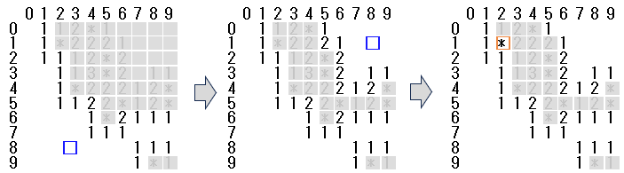

# アルゴリズムデザインコンテスト(ADC)概要

DAシンポジウムでは、2012年からデザインコンテストを開催しています。
2025年のテーマは「マインスイーパー※」です。
「マインスイーパー」は正方形のセルが敷き詰められたフィールドにおいて地雷を避けながら全てのセルを開ける
コンピュータゲームです。
昨年同様、**プログラミング競技**と**FPGA競技**を行います。
出題される課題に対して独自の解法を考案し、それを実現するシステムを作成していただきます。
シンポジウム期間内に行われるADCセッションにおいて、皆様の作成したシステムの内容を発表していただき、
審査によって賞を授与いたします。多くの皆様のご参加をお待ちしております。

※マインスイーパー(Minesweeper)は1980年代に開発されたゲームでMicrosoft Windows にも付属していた（Wikipedia より）。

## 競技テーマ：「マインスイーパー」

上記はテキストファイルで記述したサンプルの盤面です。
この例では座標を分かりやすくするために1行目と1列目に座標値が入っています。
セルに書かれている「*」は地雷、「数字」は隣接する8個のセルに含まれる地雷の数を表します。
ひとつずつセルを開いていき、地雷を除く全てのセルを開けることができれば成功です。
「空白」セルを開けた場合は、地雷がない隣接するセルを再帰的に開くことができます。
図中の青い四角は選択したセルです。3手目のように地雷を選択した時点でゲームは終了です。
なお、実際の盤面データは上記のサンプル画像とは異なり、地雷や空白のデータにも数字を使用しています。
実際のルールについては下記の詳細をご覧ください。

### 各競技の詳細はコチラ！
- プログラミング競技について (詳細はお待ちください)
<!-- - [プログラミング競技について](programming.md) -->
- FPGA競技について (詳細はお待ちください)
<!-- - [FPGA競技について](fpga.md) -->

## これ以下はまだ作成中のため、記載されている内容は未確定の情報となっています。コンテストの参加申し込みもまだ行っておりません。

## 更新情報

- 2025-04-01 初版を公開しました

## コンテスト参加申し込み

- ADC へ参加を希望される方は、(1) DAシンポジウム「論文募集」ページの論文投稿フォームより参加申し込みをお願いいたします。
  - **(1) [論文募集ページ](http://www.sig-sldm.org/das/CFP.html) のと論文投稿フォーム**  (投稿フォームの開設はお待ちください)
     - 申込締切：2025年6月13日(金) (予定)
- また、ADC へ参加を希望される方は、チーム名や連絡等の追加情報をいただきたく、下記 GitHub ページの (2)「参加者入力フォーム」もご記入いただければと思います。
  - **(2) [参加者入力フォーム](https://docs.google.com/forms/d/e/1FAIpQLSfbciewyNyLX1NT-Bf8tRg1Y8yI8qc3__4G5I58hR3xoZP96A/viewform?usp=header)**　(入力フォームの開設はお待ちください)
- コンテストへの参加はチームでの参加も可能です。(2) においてチーム名をご記入いただければと思います。
- 申込締切：2025年6月13日(金) (予定)
<!-- - 参加者入力フォーム (開設はお待ちください)-->
- コンテスト参加者向け情報は、下記 GitHub ページにて発信していきます。更新情報を参考にご覧いただければと思います。
  - **GitHub ページ [アルゴリズムデザインコンテスト 2025](https://dasadc.github.io/adc2025)**

## 論文募集について
  - ADC も DA シンポジウムの論文募集要綱に従う形で以下の2形式を推奨します。
    - ポスター発表（必要論文頁数：2-6）
    - 一般公演 + ポスター発表（必要論文頁数：6-8）
  - (1)「論文募集ページ」の投稿フォームより、以下のいずれかを選択して下さい。
    - 「アルゴリズムデザインコンテスト（ポスター発表）」
    - 「アルゴリズムデザインコンテスト（ポスター発表）＋ 一般講演」
  - DA シンポジウム当日にライトニングトークとポスター発表をお願いいたします。

## コンテストのみ（論文投稿なし）の参加について
  - 多くの方にご参加いただけるようにコンテストのみの参加も可能となっております。
  - 論文投稿を行わない場合は (2)「参加者入力フォーム」のみをご記入いただければと思います。
  - 参加申し込みの際「論文投稿の有無について」の項目より「論文投稿なし、ポスター発表」を選択して下さい。
  - この場合、DAシンポジウム・プログラムには何も掲載されませんが、DA シンポジウム当日にライトニングトークとポスター発表を行っていただきます。
  
## 課題提出の締め切り
- プログラミング競技、FPGA競技ともに、2025年8月20日(水)まで課題提出が可能です。

## 問い合わせ先・その他
- ポスター発表が含まれますので、発表当日は必ず現地までお越しください。
- ご不明点等がございましたら das”at”sig-sldm.org より、ADC 事務局あてご連絡をいただければと思います。（”at”は@に変換してください）。どうぞよろしくお願いいたします。
