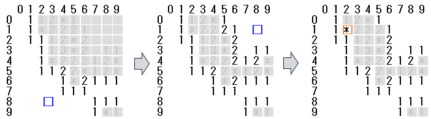

# アルゴリズムデザインコンテスト(ADC)概要

DAシンポジウムでは、2012年からデザインコンテストを開催しています。
2026年のテーマは、昨年に引き続き「マインスイーパー※」です。
本テーマは2025年のコンテストにおいて好評を博したことから、内容を発展させた形で継続実施いたします。

「マインスイーパー」は正方形のセルが敷き詰められたフィールドにおいて、地雷を回避しながらすべてのセルを開くコンピュータゲームです。昨年同様、**プログラミング競技**と**FPGA競技**の2部門を開催いたします。なお、ルール、採点方法、評価基準については一部変更を予定しております。

参加者の皆様には、出題される課題に対して独自の解法を考案いただき、それを実現するシステムを構築していただきます。
また、シンポジウム期間中に開催されるADCセッションにおいて、作成したシステムの内容についてポスター形式で発表いただきます。審査の結果に基づき、優れた発表には賞を授与いたします。

多くの皆様のご参加を心よりお待ちしております。

※マインスイーパー(Minesweeper)は1980年代に開発されたゲームでMicrosoft Windows にも付属していた（Wikipedia より）。

## 競技テーマ：「マインスイーパー」

上記はテキストファイルで記述したサンプルの盤面です。
この例では座標を分かりやすくするために1行目と1列目に座標値が入っています。
セルに書かれている「*」は地雷、「数字」は隣接する8個のセルに含まれる地雷の数を表します。
ひとつずつセルを開いていき、地雷を除く全てのセルを開けることができれば成功です。
「空白」セルを開けた場合は、地雷がない隣接するセルを再帰的に開くことができます。
図中の青い四角は選択したセルです。3手目のように地雷を選択した時点でゲームは終了です。
なお、実際の盤面データは上記のサンプル画像とは異なり、地雷や空白のデータにも数字を使用しています。
実際のルールについては下記の詳細をご覧ください。

### 各競技の詳細はコチラ！
- **[プログラミング競技について]** 準備中
- **[FPGA競技について]** 準備中

<!--
- **[プログラミング競技について](programming.html)**
- **[FPGA競技について](fpga.html)**
-->
## 更新情報 
- 2026-04-08 初版を公開しました

## 参加申し込み

ADCへの参加を希望される方は、以下の手順にしたがってお申込みください。  
個人参加およびチーム参加のいずれも可能です。

1. DAシンポジウムの「論文投稿フォーム」よりお申込みください。  
2. 「参加者入力フォーム」にチーム名や連絡先など追加情報のご記入をお願いいたします。  

また、シンポジウム当日は、簡単な自己紹介またはチーム紹介（約1分）およびポスター発表をいただきます。

なお、ADCのみ（一般講演なし）での参加も可能です。

---

### 申込フォーム

- (1) [論文投稿フォーム：DAシンポジウム2026 発表申込書](https://www.ipsj.or.jp/02moshikomi/event/event-da2026-toukou.html)  
- (2) [参加者入力フォーム：DAシンポジウム2026 ADC参加者入力フォーム](https://docs.google.com/forms/d/e/1FAIpQLSdexpTirWx-fF5K0DiO6b_p1xdLoqyB7nrfWg7OEV0LaWNbGg/viewform)

## コンテストの参加について
<!--
  - ADC も DA シンポジウムの論文募集要綱に従う形で以下の2形式を推奨します。
    - ポスター発表（必要論文頁数：2-6）
    - 一般講演 + ポスター発表（必要論文頁数：6-8）
  - (1)「論文募集ページ」の投稿フォームより、以下のいずれかを選択して下さい。
    - 「アルゴリズムデザインコンテスト（ポスター発表）」
    - 「アルゴリズムデザインコンテスト（ポスター発表）＋ 一般講演」
  -->
  <!--
ADCはポスターの持ち込みが必要、ポスターの内容を一般講演として発表可能、その場合は他の講演と同様に原稿の提出が必要
  -->
  - DA シンポジウム当日は、ADCセッションにおいて簡単な自己紹介またはチーム紹介（約1分）およびポスター発表いただきます。
  - 多くの方にご参加いただけるようにコンテストのみの参加も可能となっております。

<!--
  - 参加申し込みの際「論文投稿の有無について」の項目より「論文投稿なし、ポスター発表」を選択して下さい。
  - この場合、DAシンポジウム・プログラムには何も掲載されませんが、DA シンポジウム当日にライトニングトークとポスター発表を行っていただきます。-->

## 課題提出の締め切り
- プログラミング競技、FPGA競技ともに、2026年8月17日(月)23:59まで課題提出が可能です。

## 問い合わせ先・その他
- ポスター発表が含まれますので、発表当日は必ず現地までお越しください。
- ご不明点等がございましたら das”at”sig-sldm.org より、ADC 事務局あてご連絡をいただければと思います。（”at”は@に変換してください）。どうぞよろしくお願いいたします。
