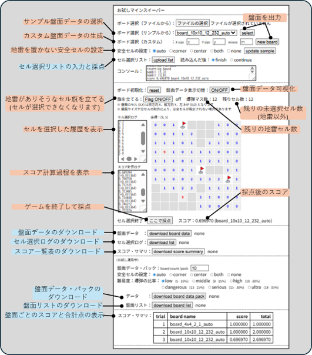
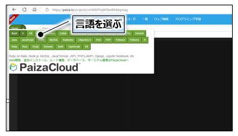
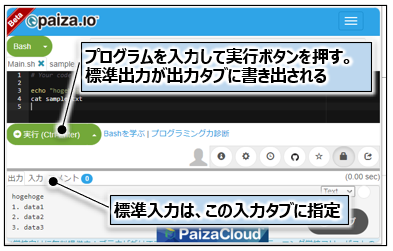
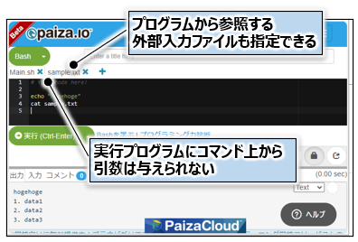
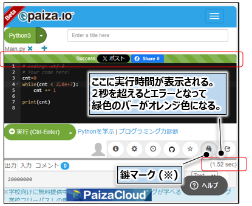
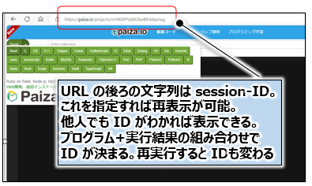
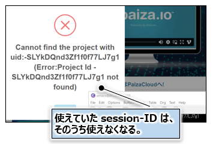

<script type="text/x-mathjax-config">MathJax.Hub.Config({tex2jax:{inlineMath:[['\$','\$'],['\\(','\\)']],processEscapes:true},CommonHTML: {matchFontHeight:false}});</script>
<script type="text/javascript" async src="https://cdnjs.cloudflare.com/ajax/libs/mathjax/2.7.1/MathJax.js?config=TeX-MML-AM_CHTML"></script>


# プログラミング競技について

## 更新情報 []()
- 2026-06-19 競技用盤面を公開しました
- 2026-04-28 初版を公開しました

## 競技概要
- 「**マインスイーパー**」の問題を自動的に解く **ソフトウェア** を設計してください。
- 「マインスイーパー」の基本ルールは **FPGA競技と同一** です。
  
## 問題文
複数の「マインスイーパー」の盤面データが与えられます。各盤面について地雷が存在し得るセルを予測しながら、地雷以外のすべてのセルを選択することを目指します。以下の「ルール」に従って、可能な限り多くのセルを選択し、高いスコアを目指して下さい。

## サンプル盤面
「マインスイーパー」の遊び方イメージを以下のサイトで体感することができます。今回のコンテストの出題形式に似せて事務局で作成したもので、盤面の様子や進行方法などはオリジナルとは異なっています。スマートフォンからもアクセスできます。

###  [＝＝＞「マインスイーパー」をお試し実行できるページ](msprog/mssample.html)



## 操作方法
1. **「ボード選択」** からボードを選びます。サンプル盤面をいくつかご用意しています。盤面のテキストファイルを作成すればファイルから読み込むことも可能です。
2. **「盤面データ表示切替」** をトグルすると盤面データの参照ができます。
3. 盤面データには「０」から「９」までの数字が含まれています。「０」から「８」までの「数字」は **隣接する８個のセルに含まれる地雷の数** を表します。地雷が周囲に存在しない場合、盤面データは空白ではなく「０」となってます。
4. 盤面データ「９」が含まれるセルは **地雷が置かれた状態** を示します。周囲の地雷の数ではありません。
5. 盤面のセル座標 (X,Y) は横方向 X、縦方向 Y で、左上が (0,0)、右下に向かって座標が１つずつ増えます。
6. セルをひとつずつ選択していきます。地雷以外の **未選択セル** がなくなれば終了です。スコアが表示されます。
7. 盤面データ「０」のセルを選択した場合は、周囲に地雷は存在しないため、地雷に近くなるまで再帰的に周囲のセルが選択されます。
8. 地雷を除く未選択のセル数が **「残りセル数」** に表示されます。
9. 地雷がありそうな場所に **旗を立てて** 選択できないようにすることができます。**「旗を立てる」** を ON にしてから当該セルを選択します。旗を解除するには再度「旗を立てる」を ON にして当該セルを選択します。旗が無くなればセル選択が可能になります。
10. 旗が立っているセルは選択できなくなりますが、周囲に「０」のセルがある場合は再帰的に選択されて旗が消えることがあります。
11. 途中で終了したい場合、一番下にある **「ここで採点」** をクリックすればスコアが表示されて終了となります。

## ルールとスコア 
- 1盤面あたりのスコアは、-1点~1点の範囲となります。
- 安全セルを1つ開けた場合、(1 / 盤面の全セル数 - 地雷セル数) を加点します。
- 地雷セルを1つを開けた場合、 (1 / 盤面の全地雷セル数) を減点します。
- 1盤面あたりのスコアは、以下の式で表されます。
  <br><br>
  $\text{score} = \frac{\text{開けた安全セル数}}{\text{盤面の全セル数} - \text{盤面の全地雷セル数}} - \frac{\text{開けた地雷セル数}}{\text{盤面の全地雷セル数}}$
  <br><br>
- 各盤面のスコアは、**小数点第5位で切り捨て（小数点第4位までを有効）** として評価します。
- 地雷セルを開けずに、全ての安全セルを開けた場合は**1点**となります。
- 地雷セルのみを全て開けた場合は **-1点** となります。
- 盤面上の全セル（安全セル＋地雷セル）を開けた場合は**0点**となります。

- 開発していただくプログラムは、**入力として盤面データ**を読み込み、**解答した盤面数、実行時間、および解答した盤面の合計スコアを出力**するものとします。

- 入力として与えられる盤面データを解析すれば地雷セルの位置を特定できますが、「マインスイーパー」を解くプログラムにおいては、地雷セルの位置は分からないものとして実装してください。
- 選択済みのセルから得られる情報を元に、次のセルを選択することは問題ありません。
- 選択した地雷セルの位置情報を利用することは問題ありません。
- プログラムは **[paiza.IO 環境<sup>※</sup>](https://paiza.io/ja/projects/new)** で実行いただきます。paiza 環境の仕様に従い、**実行時間の最大値は2秒** です。
- 複数の盤面が与えられます。2秒以内により多くの問題を解いていただき、他の参加者よりも **合計のスコアが高くなる** ことを目指して下さい。

  ※ paiza.IOは **ブラウザだけで** プログラミングが始められる **オンラインのプログラム実行環境** です。無料で使用できます。ユーザー登録も不要です。
  下記「paiza.IO の使い方」もご覧ください。

## プログラムの入力
- **盤面データ** がプログラムの入力となります。以下の形式に従ったテキストファイルです。
- ファイルの読み込み方法は自由です。標準入力に与えても構いません。
- 1つのファイルに **複数の盤面データ** が入っています。
- 競技で実際に使用する盤面データについては [競技用盤面データの提供](#競技用盤面データの提供) をご参照下さい。
- 盤面データは、以下の繰り返しで構成されます。
  - ヘッダ1行: `<Xサイズ(列数)> <Yサイズ(行数)> <地雷セル数> <盤面名>`
  - 盤面行: 各行は `<Xサイズ(列数)>` 文字の数字列（0-9）で構成されます。
  - 盤面と盤面の間には空行が入ります。

- 盤面データ中の数字は、以下の意味を持ちます。
  - 0～8：各セルにおける隣接地雷数  
　　周囲8セルに存在する地雷セルの数を表します。
  - 9：地雷セル

- paize 環境の実行時間の最大値は **2秒** ですので、**その時間内で可能な限り** 解いてください。

```
6 4 2 board_name     <-- 左から Xサイズ(横)、Yサイズ(縦)、地雷数、盤面の名前がスペースで区切られています
011100             <-- X個の盤面データ、これは1行目
019100             <-- X個の盤面データ、これは2行目
011211             <-- X個の盤面データ、これは3行目
000191             <-- X個の盤面データ、これは4行目、Y 行目でこの盤面データは終了
                   <-- 空行を挟みます
4 4 2 board2         <-- 次の盤面データ、この要領で複数の盤面データを連続して記述
0111
1291
1921
1110
```

## プログラムの出力
- **解答した盤面数、実行時間、および解答した盤面の合計スコア** を記録いただくため、これらの情報を出力ください。


## お試し盤面データの生成 []()
- [「マインスイーパー」をお試し実行できるページ](#サンプル盤面) からお試し盤面の生成及び **盤面データ** のダウンロードができるようになりました。プログラム開発にご活用ください。**「ボード選択」** からボードを選ぶと画面に盤面が表示されます。**画面に表示されたボード** は下の方にある **「盤面データ：download board data」** からダウンロード可能です。
- サンプルとして付属している盤面だけでなく、**Xサイズ**(横)、**Yサイズ**(縦)、**地雷の数** を与えて新しい盤面を生成することが可能です。**「ボード選択（カスタム）：new board」** から生成して下さい。画面に表示されたボードはダウンロードが可能です。
- 大規模なボードは生成できない場合があります。また、地雷の数は盤面サイズに従い自動調整されます。
- 盤面データは　**「プログラムの入力」** に従ったフォーマットのテキストファイルです。1行目に Xサイズ(横)、Yサイズ(縦)、地雷数、盤面の名前をスペースで区切ったヘッダが付いています。
- 盤面データにおける地雷の位置は疑似乱数を用いて自動発生しています。
- **ボード名** のフォーマットは `board_{Xサイズ}x{Yサイズ}_{地雷数}_{seed}_{安全セルの配置モード}` です。
- seed は疑似乱数へ与えるパラメータの初期値です。同じ初期値からは同じ盤面データが生成されます。
- 盤面データのダウンロード・ファイルは `ボード名.txt` です。

## お試し盤面データパックのダウンロード []()
- 複数の盤面データを含むテキストファイルのダウンロードができるようになりました。**(1)盤面データの個数、(2)安全セルの設定、(3)難易度**、のカスタマイズが可能です。
- **「盤面データ・パックの download board data pack」** からダウンロード可能です。
- (1) 盤面データの個数： 10個単位で増減が可能です。
- (2) 地雷が置かれていない安全セルの配置モード：  [安全セルの指定](#安全セルの指定-) に従います。
- (3) 難易度： **全セルにおける爆弾数の割合**から、次の6種類を設けました。
1. low： 5% - 10%
2. middle： 8% - 15%
3. high： 10% - 20%
4. dangerous： 13% - 25%
5. serious： 15% - 30%
6. ultra： 18% - 35%
- 盤面サイズは縦、横、独立に 4 から 20 までのランダム値となります。
- 爆弾数の下限は **3 個** となっています。low モードの場合、4x4=16 セルの 5% は 1 個未満ですが、下限制約から 3 個になります。
- お試し盤面データパックのダウンロード・ファイルは `board_pack_{盤面数}_{安全セルの配置モード}_{難易度}.txt` です。

## 競技用盤面データの提供について []()
-  盤面データはテキストファイル（`board_pack_10000_prog.txt`）です。以下からダウンロードください。
- [==> FPGA 競技用盤面データのダウンロード](adc2026_minesweeper_prog_benchmark.zip)
- 最大の盤面サイズは **19x19** です。
- なお、最初に選択したセルが安全セルである保証はありません。

## プログラム実行結果の提出について []()
- 競技用盤面データに対する実行結果を、**[上記](#競技用盤面データの提供)でダウンロードしたzipファイルに同梱の `Excelファイル（minesweeper_prog_result.xlsx）`** に記入ください。
- Excelファイル は 2 つのシートを含みます。それぞれ記入ください。

## 提出方法 
- **以下2点を`adc.das.sldm@gmail.com` より、ADC 事務局宛にご提出ください**。
  - `マインスイーパーを解くプログラム`
  - `実行結果を記録した Excelファイル（minesweeper_prog_result.xlsx）`
- 提出物に不足がある場合、または Excelファイルの記載が不十分な場合は、**評価対象外** となります。**提出後に不備に気づいた場合は、提出期限内に限り再提出を受け付けます** 。

- メール本文には「参加者入力フォーム」に記載いただいた**お名前もしくはチーム名** を明記ください。
- 受領しましたら、ADC 事務局メンバーより返信いたします。
- **提出期限は 2026年8月17日(月) 23:59 (JST)** です。

## paize.IO の使い方
- **[paize.IO](https://paiza.io/ja/projects/new)** の詳細はサイトが提供する **[利用ガイド](https://paiza.io/help)** に記載がございます。以下は簡単な仕様の抜粋です。

  |項目|paizaの仕様|
  |---|---|
  |言語|33言語|
  |実行時間制限|2秒|
  |メモリ制限|512MB|
  |ソースコードサイズ制限|？(記載なし) |

  - ソースコードサイズについて、事務局では数MByte のコード(print 文を大量に記述したもの)について実行ができることは確認しています。
  
- 以下にサンプル画面とウィンドウ操作について簡単に説明します。

#### 言語を選ぶ


#### プログラムの実行



#### プログラムの実行時間

- 鍵マークはコードの公開・非公開を切り替えることができます。公開コードはすべての人の一覧に表示されますが、非公開コードはURLを知っている人だけがアクセスできます。例えば、公開はしたくないが何人かに知らせたい場合、非公開にしてURLのみ連絡することができます。非公開にしたからと言ってコードが見えなくなるわけではありません。URLを知っている人ならばだれでもアクセスが可能です。

#### セッション ID について



